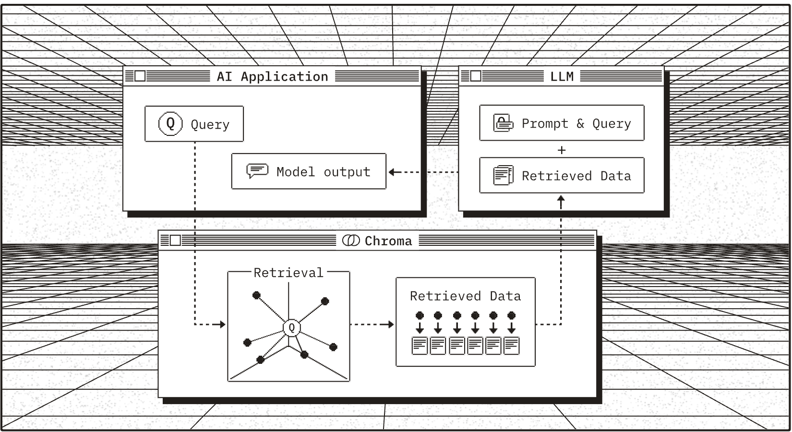

# InSecure

<br>The InSecure Coding Assistant

# Workflow

<br>RAG Workflow using Chroma. Image source: [Chroma](https://www.trychroma.com/)

### Config

0. Install [Ollama](https://ollama.com/)
```bash
brew install ollama
ollama start && ollama pull codegemma && ollama pull nomic-embed-text
```

1. Install [Chroma](https://cookbook.chromadb.dev/running/running-chroma/#chroma-cli)
```bash
pip install chromadb
chroma run --host localhost --port 8000 --path embeddings
```

### Installation

2. Install nvm using brew and install latest version of Nodejs
``` bash
brew install nvm
nvm install --lts
```

3. Clone Repo
``` bash
git clone https://github.com/cotom/InSecure.git && cd InSecure
```

4. Install and run
``` bash
npm install && npm start
```

5. Environment Variables: Set the followign environment variables
```bash
export SLACK_SIGNING_SECRET=<YOUR SECRET>
export SLACK_BOT_TOKEN=<YOUR TOKEN>
export APP_TOKEN=<YOUR APP TOKEN>
export NODE_ENV="development" | "local" // Local to build embeddings
export SLACKBOT_SERVER_PORT=3000 // Defaut port for slackbot server
export BUILD_EMBEDDINGS="false" // Set to true to build embeddings, slow process only needs to run once, enuser Chroma is running
```

### References

- [@Slack/Bolt](https://www.npmjs.com/package/@slack/bolt)
- [@Slack/Bolt: Getting Started](https://tools.slack.dev/bolt-js/getting-started)
- [SlackBotDocs](https://tools.slack.dev/bolt-js/concepts/message-listening)
- [ollama-js](https://github.com/ollama/ollama-js)
- [codellama](https://ollama.com/library/codellama)